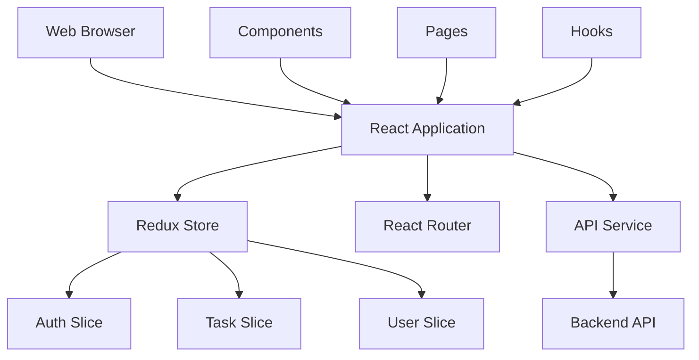

# MIRSAT Portal - Frontend

## Project Overview

MIRSAT Portal frontend is a React-based web application built with TypeScript and Vite, providing a comprehensive interface for task management, inspection handling, and user administration.

## Architecture Overview



## Technology Stack
- React 18+
- TypeScript 5+
- Vite 4+
- Redux Toolkit
- React Router 6+
- Material-UI (MUI)
- Tailwind CSS
- React Query (optional)

## Project Structure
```
mirsat-frontend/
├── src/
│   ├── components/     # Reusable components
│   │   ├── common/
│   │   ├── layout/
│   │   └── features/
│   ├── pages/         # Route components
│   ├── store/         # Redux store setup
│   │   └── slices/    # Redux slices
│   ├── services/      # API services
│   ├── hooks/         # Custom hooks
│   ├── utils/         # Utility functions
│   ├── types/         # TypeScript types
│   ├── styles/        # Global styles
│   ├── App.tsx
│   └── main.tsx
├── public/           # Static files
├── .env.example
├── index.html
├── package.json
├── tailwind.config.js
├── tsconfig.json
├── vite.config.ts
└── README.md
```

## Setup Instructions

### Prerequisites
- Node.js (v18 or higher)
- npm or yarn
- Modern web browser

### Installation

1. Clone the repository:
```bash
git clone https://github.com/your-org/mirsat-portal.git
cd mirsat-frontend
```

2. Install dependencies:
```bash
npm install
```

3. Create environment file:
```bash
cp .env.example .env
```

4. Update environment variables in `.env`:
```env
VITE_API_URL=http://localhost:5000/api/v1
VITE_SOCKET_URL=http://localhost:5000
```

5. Start development server:
```bash
npm run dev
```

## Features

### Role-Based Access Control
```typescript
type UserRole = 'admin' | 'management' | 'inspector';

interface Permission {
  route: string;
  actions: ('create' | 'read' | 'update' | 'delete')[];
}
```

### Component Examples

#### Permission Gate Component:
```tsx
const PermissionGate: React.FC<{
  permission: string;
  children: React.ReactNode;
}> = ({ permission, children }) => {
  const hasPermission = usePermission(permission);
  return hasPermission ? <>{children}</> : null;
};
```

#### Task Creation:
```tsx
const CreateTaskButton: React.FC = () => {
  return (
    <PermissionGate permission="create_task">
      <Button
        variant="contained"
        startIcon={<AddIcon />}
        onClick={handleCreateTask}
      >
        Create Task
      </Button>
    </PermissionGate>
  );
};
```

## User Interface

### Pages
- Login/Register
- Dashboard
- Task Management
- User Administration
- Reports & Analytics
- Profile Settings

### Components
- Navigation
- Data Tables
- Forms
- Modals
- Charts
- File Upload

## State Management

### Redux Store Structure
```typescript
interface RootState {
  auth: AuthState;
  tasks: TaskState;
  users: UserState;
  ui: UIState;
}

interface AuthState {
  user: User | null;
  token: string | null;
  loading: boolean;
  error: string | null;
}
```

### API Integration
```typescript
// services/api.ts
const api = axios.create({
  baseURL: import.meta.env.VITE_API_URL,
  headers: {
    'Content-Type': 'application/json'
  }
});

// Add auth token
api.interceptors.request.use((config) => {
  const token = store.getState().auth.token;
  if (token) {
    config.headers.Authorization = `Bearer ${token}`;
  }
  return config;
});
```

## Available Scripts
```bash
npm run dev          # Start development server
npm run build        # Build for production
npm run preview     # Preview production build
npm run lint        # Run ESLint
npm run lint:fix    # Fix ESLint errors
npm test           # Run tests
```

## Testing
```bash
# Run all tests
npm test

# Run with coverage
npm run test:coverage

# Run specific test file
npm test -- src/components/Task.test.tsx
```

## Styling
- Tailwind CSS for utility classes
- MUI components for base UI
- CSS modules for component-specific styles
- Theme customization

## Performance Optimization
- Code splitting
- Lazy loading
- Memoization
- Image optimization
- Bundle size optimization

## Error Handling
```typescript
const ErrorBoundary: React.FC<{ children: React.ReactNode }> = ({
  children
}) => {
  const [hasError, setHasError] = useState(false);

  if (hasError) {
    return <ErrorPage />;
  }

  return <>{children}</>;
};
```

## Contributing
1. Fork the repository
2. Create a feature branch
3. Commit your changes
4. Push to the branch
5. Create a Pull Request

## Production Deployment
1. Build the application:
```bash
npm run build
```

2. Test the production build:
```bash
npm run preview
```

3. Deploy the `dist` folder to your hosting service

## Browser Support
- Chrome (last 2 versions)
- Firefox (last 2 versions)
- Safari (last 2 versions)
- Edge (last 2 versions)

## License
MIT License - see LICENSE.md

## Support
For support, email support@mirsat-portal.com or create an issue in the repository.
