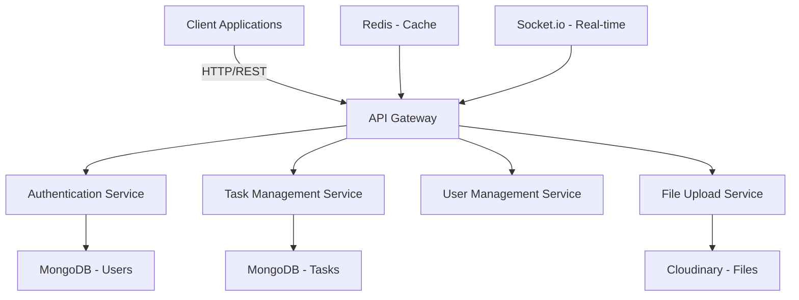

# MIRSAT Portal - Backend

## Project Overview

The MIRSAT Portal backend is a Node.js/Express application built with TypeScript that provides API services for task management, user authentication, and inspection report handling.

## Architecture Overview



## Technology Stack
- Node.js v18+
- TypeScript v5+
- Express.js v4+
- MongoDB v5+
- JWT for authentication
- Socket.io for real-time updates
- Cloudinary for file storage
- Redis for caching (optional)

## Project Structure
```
mirsat-backend/
├── src/
│   ├── config/         # Configuration files
│   ├── controllers/    # Request handlers
│   ├── middleware/     # Custom middleware
│   ├── models/         # Database models
│   ├── routes/         # API routes
│   ├── services/       # Business logic
│   ├── types/          # TypeScript types/interfaces
│   ├── utils/          # Utility functions
│   ├── validations/    # Request validation schemas
│   ├── app.ts         # Express app setup
│   └── server.ts      # Entry point
├── tests/             # Test files
├── logs/              # Application logs
├── .env.example       # Environment variables template
├── .gitignore
├── package.json
├── tsconfig.json
└── README.md
```

## Setup Instructions

### Prerequisites
- Node.js (v18 or higher)
- MongoDB (v5 or higher)
- npm or yarn
- TypeScript

### Installation

1. Clone the repository:
```bash
git clone https://github.com/your-org/mirsat-portal.git
cd mirsat-backend
```

2. Install dependencies:
```bash
npm install
```

3. Create environment file:
```bash
cp .env.example .env
```

4. Update environment variables in `.env`:
```env
PORT=5000
MONGODB_URI=mongodb://localhost:27017/mirsat
JWT_SECRET=your_jwt_secret
JWT_EXPIRE=24h
NODE_ENV=development
CLOUDINARY_NAME=your_cloudinary_name
CLOUDINARY_API_KEY=your_key
CLOUDINARY_API_SECRET=your_secret
```

5. Start development server:
```bash
npm run dev
```

## API Endpoints

### Authentication
- POST `/api/v1/auth/register` - Register new user
- POST `/api/v1/auth/login` - User login
- POST `/api/v1/auth/forgot-password` - Request password reset
- POST `/api/v1/auth/reset-password` - Reset password

### Users
- GET `/api/v1/users` - Get all users
- POST `/api/v1/users` - Create user
- GET `/api/v1/users/:id` - Get user by ID
- PUT `/api/v1/users/:id` - Update user
- DELETE `/api/v1/users/:id` - Delete user

### Tasks
- GET `/api/v1/tasks` - Get all tasks
- POST `/api/v1/tasks` - Create task
- GET `/api/v1/tasks/:id` - Get task by ID
- PUT `/api/v1/tasks/:id` - Update task
- DELETE `/api/v1/tasks/:id` - Delete task
- POST `/api/v1/tasks/:id/photos` - Upload task photos

## Core Features

### User Roles & Permissions
```typescript
enum UserRole {
  ADMIN = 'admin',
  MANAGEMENT = 'management',
  INSPECTOR = 'inspector'
}

interface Permission {
  create: boolean;
  read: boolean;
  update: boolean;
  delete: boolean;
}
```

### Task Management
```typescript
interface Task {
  title: string;
  description: string;
  status: 'pending' | 'in_progress' | 'completed' | 'incomplete';
  assignedTo: string;
  priority: 'low' | 'medium' | 'high';
  deadline: Date;
  photos: string[];
}
```

### File Upload
- Supports image uploads
- Files stored in Cloudinary
- Automatic image optimization
- Secure file handling

## Available Scripts
```bash
npm run dev          # Start development server
npm run build        # Build for production
npm start           # Run production server
npm run lint        # Run ESLint
npm run lint:fix    # Fix ESLint errors
npm test           # Run tests
```

## Testing
```bash
# Run all tests
npm test

# Run with coverage
npm run test:coverage

# Run specific test file
npm test -- tests/auth.test.ts
```

## Security Features
- JWT Authentication
- Rate Limiting
- CORS Protection
- Helmet Security Headers
- Password Hashing
- Request Validation

## Error Handling
```typescript
class ApiError extends Error {
  statusCode: number;
  status: string;
  
  constructor(statusCode: number, message: string) {
    super(message);
    this.statusCode = statusCode;
    this.status = `${statusCode}`.startsWith('4') ? 'fail' : 'error';
  }
}
```

## Logging
- Winston logger integration
- Error tracking
- Request logging
- Performance monitoring

## Contributing
1. Fork the repository
2. Create a feature branch
3. Commit your changes
4. Push to the branch
5. Create a Pull Request

## Production Deployment
1. Build the application:
```bash
npm run build
```

2. Set production environment variables:
```env
NODE_ENV=production
PORT=5000
MONGODB_URI=your_production_mongodb_uri
```

3. Start the server:
```bash
npm start
```

## Monitoring & Maintenance
- Use PM2 for process management
- Monitor server resources
- Regular database backups
- Error tracking with Winston

## License
MIT License - see LICENSE.md

## Support
For support, email support@mirsat-portal.com or create an issue in the repository.
