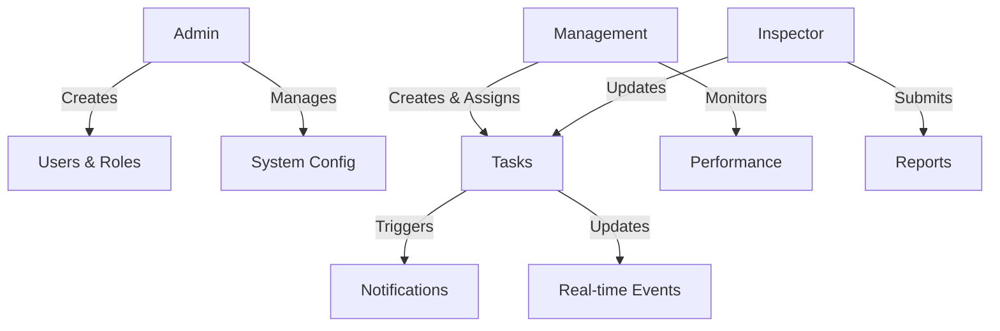

# MIRSAT Backend

## Project Overview
MIRSAT is an inspection platform designed to streamline task management, assignment, and tracking for inspectors while providing comprehensive reporting and administrative functionalities for Admin and Management teams.

## Features
- 🔐 Role-based Authentication & Authorization
- 👥 User Management
- 📋 Task Management
- 📊 Real-time Notifications
- 📁 File Upload & Management
- 📅 Calendar Integration
- 📝 Reporting System
- 🔄 Real-time Updates via WebSocket

## Tech Stack
- Node.js
- Express.js
- TypeScript
- MongoDB
- Socket.IO
- JWT Authentication
- Cloudinary (File Storage)
- Swagger (API Documentation)

## Project Structure
```
src/
├── config/         # Configuration files
├── controllers/    # Route controllers
├── interfaces/     # TypeScript interfaces
├── middleware/     # Custom middleware
├── models/         # Database models
├── routes/         # API routes
├── services/       # Business logic
├── types/         # Type definitions
├── utils/         # Utility functions
└── validations/   # Request validation schemas
```

## Core Components

### User Roles
1. **Admin**
   - Full system access
   - User management
   - Role management
   - System configuration

2. **Management Team**
   - Task creation & assignment
   - Performance monitoring
   - Report generation

3. **Inspector**
   - Task viewing & updating
   - Photo uploads
   - Status updates
   - Report submission

### System Flow



## API Endpoints

### Authentication
- POST `/api/v1/auth/register` - Register new user
- POST `/api/v1/auth/login` - User login
- POST `/api/v1/auth/forgot-password` - Password reset request
- POST `/api/v1/auth/reset-password` - Reset password

### Users
- GET `/api/v1/users` - Get all users
- POST `/api/v1/users` - Create user
- GET `/api/v1/users/:id` - Get user details
- PUT `/api/v1/users/:id` - Update user
- DELETE `/api/v1/users/:id` - Delete user

### Roles
- GET `/api/v1/roles` - Get all roles
- POST `/api/v1/roles` - Create role
- GET `/api/v1/roles/:id` - Get role details
- PUT `/api/v1/roles/:id` - Update role
- DELETE `/api/v1/roles/:id` - Delete role

### Tasks
- GET `/api/v1/tasks` - Get all tasks
- POST `/api/v1/tasks` - Create task
- GET `/api/v1/tasks/:id` - Get task details
- PUT `/api/v1/tasks/:id` - Update task
- PUT `/api/v1/tasks/:id/status` - Update task status
- POST `/api/v1/tasks/:id/comments` - Add task comment
- POST `/api/v1/tasks/:id/attachments` - Upload task attachment

### Notifications
- GET `/api/v1/notifications` - Get user notifications
- PUT `/api/v1/notifications/:id/read` - Mark notification as read
- PUT `/api/v1/notifications/read-all` - Mark all notifications as read
- DELETE `/api/v1/notifications/:id` - Delete notification

## Setup & Installation

1. Clone the repository
```bash
git clone <repository-url>
```

2. Install dependencies
```bash
npm install
```

3. Environment Setup
Create `.env` file:
```env
NODE_ENV=development
PORT=5000
MONGODB_URI=mongodb://localhost:27017/mirsat
JWT_SECRET=your_jwt_secret
JWT_EXPIRES_IN=24h

# Email Configuration
SMTP_HOST=smtp.example.com
SMTP_PORT=587
SMTP_USER=your_email
SMTP_PASS=your_password
SMTP_FROM=noreply@mirsat.com

# Cloudinary Configuration
CLOUDINARY_CLOUD_NAME=your_cloud_name
CLOUDINARY_API_KEY=your_api_key
CLOUDINARY_API_SECRET=your_api_secret
```

4. Start Development Server
```bash
npm run dev
```

5. Build for Production
```bash
npm run build
```

## WebSocket Events

### Task Events
- `task:create` - New task created
- `task:update` - Task updated
- `task:status_change` - Task status changed
- `task:comment` - New comment added

### Notification Events
- `notification:new` - New notification
- `notification:read` - Notification read
- `notification:delete` - Notification deleted

## Error Handling
- Custom error handling middleware
- Standardized error responses
- Detailed error logging

## Security Features
- JWT Authentication
- Role-based access control
- Request validation
- Rate limiting
- Security headers
- Password hashing
- File upload validation

## API Documentation
Access Swagger documentation at `/api-docs` when running in development mode.

## Project Tree
├── logs
│   ├── combined.log
│   └── error.log
├── nodemon.json
├── package.json
├── package-lock.json
├── public
│   └── index.html
├── README.md
├── src
│   ├── app.ts
│   ├── config
│   │   ├── cloudinary.ts
│   │   ├── database.ts
│   │   ├── logger.ts
│   │   ├── multer.ts
│   │   └── swagger.ts
│   ├── controllers
│   │   ├── auth.controller.ts
│   │   ├── notification.controller.ts
│   │   ├── role.controller.ts
│   │   ├── task.controller.ts
│   │   └── user.controller.ts
│   ├── interfaces
│   │   ├── auth.interface.ts
│   │   └── error.interface.ts
│   ├── middleware
│   │   ├── auth.middleware.ts
│   │   ├── error.middleware.ts
│   │   └── validate.middleware.ts
│   ├── models
│   │   ├── Notification.ts
│   │   ├── Role.ts
│   │   ├── Task.ts
│   │   └── User.ts
│   ├── routes
│   │   ├── auth.routes.ts
│   │   ├── index.ts
│   │   ├── notification.routes.ts
│   │   ├── role.routes.ts
│   │   ├── task.routes.ts
│   │   └── user.routes.ts
│   ├── server.ts
│   ├── services
│   │   ├── email.service.ts
│   │   ├── notification.service.ts
│   │   ├── socket.service.ts
│   │   └── upload.service.ts
│   ├── types
│   │   └── express
│   │       └── index.d.ts
│   ├── utils
│   │   ├── ApiError.ts
│   │   ├── catchAsync.ts
│   │   ├── constants.ts
│   │   ├── logger.ts
│   │   └── permissions.ts
│   └── validations
│       ├── auth.validation.ts
│       ├── role.validation.ts
│       ├── task.validation.ts
│       └── user.validation.ts
└── tsconfig.json

14 directories, 49 files

## Testing
```bash
# Run tests
npm test

# Run tests with coverage
npm run test:coverage


## Initial Setup

The system comes with a default admin user:
- Email: admin@mirsat.com
- Password: Admin@123!

**IMPORTANT**: For security reasons, please change the admin password immediately after first login.
You can do this by:
1. Login with default credentials
2. Go to Profile section
3. Use "Change Password" option

```

